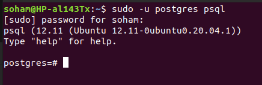
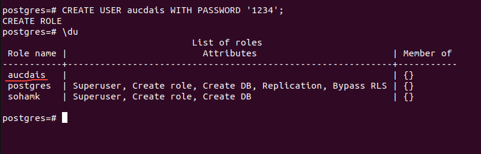
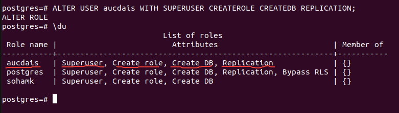
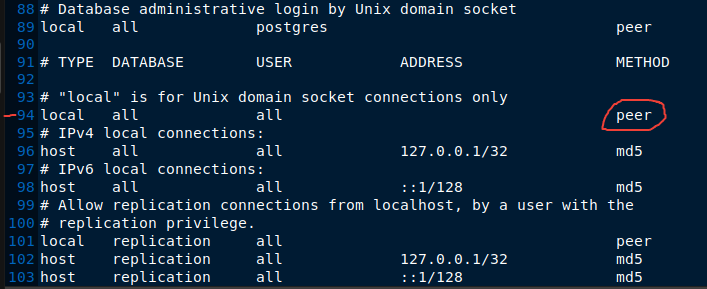
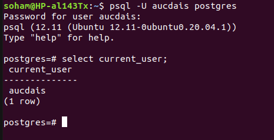

# Postgres-CreateUser

1. After installing the postgres on your machine, login by using the default “postgres” user
    
    **command**:
    
    $ sudo -u postgres psql
    
    this will initiate the postgres interactive shell in the terminal.
    
    
    

1. To create new user:
    
    we are choosing the username ‘**aucdais**’ in accordance to our project name
    
    CREATE USER aucdais WITH PASSWORD ‘1234’;
    
    
    

1. Now we need to give necessary permissions to the newly created user
    
    
    ALTER USER aucdais WITH SUPERUSER CREATEROLE CREATEDB REPLICATION;
    
    
    
2. To login as the new user ‘**aucdais**’, first logout from the current ‘**postgres**’ user by the command
    
    \q
    
    Now we have to configure the **pg_hba.conf** file to enable login for the new user.
    
    $ sudo gedit ~/../../etc/postgresql/12/main/pg_hba.conf
    
    ***Notice**:* *the version we have used here is **12**, if you are using a different version of postgres change it in the path name*. (*to check the postgres version* ⇒ $ psql --version)
    
    At this point the **pg_hba.conf** file will open up. Scroll down at the bottom. Focus on line number **94**.
    
    
    
    Change the method named “**peer**” to “**md5**”. the file will look like the below snippet.
    
    
    Now save and close the file.
    
    Restart the postgresql.
    
    $ sudo service postgresql restart
    
    Now we can easily login to our created user “**aucdais**” from the terminal
    
    $ psql -U aucdais postgres
    
    or,
    
    $ psql -U aucdais -d database_name
    
    ***Notice**: The first command is used if we want to login without specifying a database. Since we have not created any database with the user aucdais, we are sticking with the first command.*
    
    This will ask for the password of the user aucdais. Type the password **1234** as we have defined earlier.
    
    

3. If you have created a user, then proceed to create a database.
   1. Open PGAdmin4 software
   2. Create a new Database
   3. Give the database the name 'auc-dais', set all necessary options
   4. Without creating a database, the application will show errors.